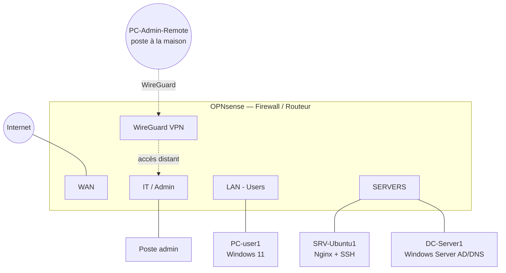

# Enterprise Network Infrastructure & Security Lab

Lab réseau complet simulant l'infrastructure d'une PME de ~50 employés : segmentation VLAN, firewall/routage OPNsense, services DHCP/DNS, Active Directory, serveur Linux, VPN d'accès distant, et un exercice de troubleshooting en conditions réelles (10 incidents rencontrés et documentés).

Projet réalisé en environnement virtualisé (VirtualBox), dans une logique d'administration système/réseau appliquée à la sécurité — en complément de mes autres labs orientés Blue Team (SIEM, détection, Active Directory).

## Objective

Concevoir, déployer, sécuriser et dépanner une infrastructure réseau d'entreprise type, en pratiquant de bout en bout : routage, NAT, DHCP, DNS, règles de pare-feu, segmentation VLAN, services Windows/Linux, VPN, et diagnostic d'incidents réseau avec Wireshark/tcpdump.

## Architecture

Voir [architecture/network-diagram.png](architecture/network-diagram.png) pour le schéma visuel détaillé (capture d'écran du plan ou export drawio).

**Note de conception** : le brief prévoit 5 réseaux (Users, Servers, IT, Guests, Management). VirtualBox limitant l'interface graphique à 4 cartes réseau par VM, le projet a été construit avec **4 réseaux** (WAN, LAN/Users, SERVERS, IT) ; le VLAN Guest a été volontairement mis de côté — la piste retenue pour l'étendre est documentée dans les pistes d'amélioration en fin de README.

## Technologies

| Catégorie | Outils |
|---|---|
| Firewall / routage | OPNsense (routing, NAT, DHCP, DNS, règles firewall, VPN WireGuard) |
| Serveur Windows | Windows Server 2022 — Active Directory Domain Services, DNS |
| Serveur Linux | Ubuntu Server 24.04 LTS — SSH (durci), Nginx |
| Analyse réseau | tcpdump (capture directe sur OPNsense), nslookup, curl |
| Virtualisation | VirtualBox (réseaux internes isolés par segment) |

*Non couvert dans cette itération : switch Cisco dédié / trunking 802.1Q via GNS3-EVE-NG, Wi-Fi corporate/guest — voir pistes d'amélioration.*

## Plan d'adressage

Voir [addressing/ip-plan.md](addressing/ip-plan.md) pour le détail et la justification du découpage retenu.

| Réseau | Rôle | Plage | Gateway |
|---|---|---|---|
| LAN | Users | 10.10.10.0/24 | 10.10.10.1 |
| SERVERS | Serveurs (IP fixes) | 10.10.20.0/24 | 10.10.20.1 |
| IT | Admin | 10.10.30.0/24 | 10.10.30.1 |
| WireGuard | VPN accès distant | 10.10.99.0/24 | 10.10.99.1 |

## Configuration

- [switching/vlan-config.md](switching/vlan-config.md) — interfaces, assignation, segmentation
- [services/dhcp.md](services/dhcp.md) — DHCP par réseau (Dnsmasq)
- [services/dns.md](services/dns.md) — résolution interne, forwarding vers Active Directory
- [services/vpn.md](services/vpn.md) — WireGuard, accès admin distant restreint

## Security — Matrice de règles firewall

Voir [firewall/firewall-rules.md](firewall/firewall-rules.md) pour le détail et la justification de chaque règle.

| Règle | Résultat |
|---|---|
| Users → Internet | ALLOW |
| Users → Servers (port 80 uniquement) | ALLOW restreint |
| Users → IT | DENY |
| IT → infrastructure | ALLOW |
| VPN (standard) → IT uniquement | ALLOW restreint, pas d'accès au reste du réseau |

## Testing

Chaque brique a été testée et validée en conditions réelles (DHCP, DNS, NAT, règles firewall inter-VLAN, accès HTTP/SSH inter-segment, VPN) — le détail des tests figure dans chaque fichier de `services/` et `firewall/`.

## Troubleshooting

**10 incidents** rencontrés — pour la plupart réellement produits en cours de projet (pas simulés après coup) — documentés dans [troubleshooting/](troubleshooting/), chacun suivant : Symptôme → Hypothèses → Commandes → Analyse → Cause → Correction → Vérification.

| # | Incident | Catégorie |
|---|---|---|
| [01](troubleshooting/incident-01.md) | Interfaces WAN/LAN inversées au premier assign | Configuration réseau |
| [02](troubleshooting/incident-02.md) | DHCP n'écoute pas sur la bonne interface (IT) | Service / configuration |
| [03](troubleshooting/incident-03.md) | Conflit DNS Dnsmasq / Unbound (forwarding company.local) | Service / conflit de port |
| [04](troubleshooting/incident-04.md) | VPN WireGuard — échec de handshake multi-causes | Réseau / NAT / firewall |
| [05](troubleshooting/incident-05.md) | Session web OPNsense invalidée après reboot VM | Application / session |
| [06](troubleshooting/incident-06.md) | Panne d'installation Windows Server (installateur, VM figée) | Installation / virtualisation |
| [07](troubleshooting/incident-07.md) | "Destination host unreachable" — VMs dépendantes éteintes | Procédure / vérification de base |
| [08](troubleshooting/incident-08.md) | Mauvaise gateway (masquée par route secondaire) | Routage |
| [09](troubleshooting/incident-09.md) | Service web (Nginx) arrêté — serveur joignable mais injoignable en HTTP | Couche application |
| [10](troubleshooting/incident-10.md) | Service DNS arrêté sur le contrôleur de domaine | Couche application / DNS |

Captures Wireshark/tcpdump utilisées pour les incidents 02, 03 et 04 (voir fichiers correspondants).

## Lessons learned

- **Deny by default** est systématique sur OPNsense dès qu'une interface est créée (OPT*) : rien ne passe tant qu'une règle explicite n'est pas ajoutée — contrairement à LAN qui a des règles "allow all" par défaut à l'installation.
- **L'ordre des règles firewall compte** : évaluation de haut en bas, première correspondance gagnante. Une règle de blocage doit être placée au-dessus des règles larges pour être effective.
- **Plusieurs services peuvent se marcher dessus silencieusement** sur un même firewall (ex. Dnsmasq et Unbound DNS actifs simultanément sur des ports différents) — une configuration correcte sur le mauvais service produit un échec sans message d'erreur explicite ; seule une capture réseau (tcpdump) permet de trancher avec certitude.
- **Toujours distinguer les couches réseau** lors d'un diagnostic : un ping réussi (couche 3) ne garantit jamais qu'un service applicatif précis (couche 7) fonctionne.
- **Vérifier les bases avant de creuser** : plusieurs incidents coûteux en temps se sont révélés être simplement des VMs éteintes ou des configurations annexes oubliées (carte réseau parasite) — un réflexe de vérification de premier niveau évite de sur-diagnostiquer.
- **Un incident non résolu documenté avec sa démarche** a autant de valeur qu'un incident résolu rapidement — ce qui compte est la méthode (isoler une variable à la fois, revérifier après chaque correction).

## Pistes d'amélioration

- VLAN Guest et switch Cisco dédié (trunking 802.1Q, STP, EtherChannel/LACP) via GNS3/EVE-NG, pour pratiquer le vrai switching en complément du routage/firewall déjà couvert
- Wi-Fi corporate/guest (nécessite un point d'accès physique ou une simulation dédiée)
- Authentification SSH par clé uniquement (actuellement mot de passe encore actif en complément)
- GPO Active Directory (politiques de groupe) non abordées dans cette itération
- Logs centralisés (pertinent pour relier ce projet à mes labs SIEM existants)
