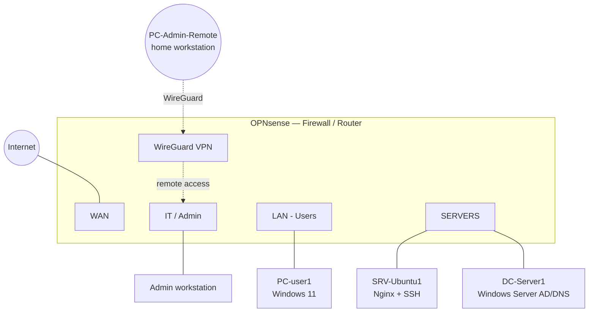

# Enterprise Network Infrastructure & Security Lab

Full network lab simulating a ~50-employee SMB infrastructure: VLAN segmentation, OPNsense firewall/routing, DHCP/DNS services, Active Directory, Linux server, remote access VPN, and a hands-on troubleshooting exercise (10 real incidents encountered and documented).

Built in a virtualized environment (VirtualBox), from a systems/network administration angle applied to security — complementing my other Blue Team-oriented labs (SIEM, detection, Active Directory).

## Objective

Design, deploy, secure, and troubleshoot a typical enterprise network infrastructure end to end: routing, NAT, DHCP, DNS, firewall rules, VLAN segmentation, Windows/Linux services, VPN, and network incident diagnosis using Wireshark/tcpdump.

## Architecture

See [architecture/network-diagram.png](architecture/network-diagram.png) for the detailed visual diagram (screenshot of the plan or drawio export).

**Design note**: the original brief called for 5 networks (Users, Servers, IT, Guests, Management). Since VirtualBox's GUI limits a VM to 4 network adapters, the project was built with **4 networks** (WAN, LAN/Users, SERVERS, IT); the Guest VLAN was deliberately set aside — the planned approach to add it is documented under Future Improvements at the end of this README.

## Technologies

| Category | Tools |
|---|---|
| Firewall / routing | OPNsense (routing, NAT, DHCP, DNS, firewall rules, WireGuard VPN) |
| Windows server | Windows Server 2022 — Active Directory Domain Services, DNS |
| Linux server | Ubuntu Server 24.04 LTS — hardened SSH, Nginx |
| Network analysis | tcpdump (captured directly on OPNsense), nslookup, curl |
| Virtualization | VirtualBox (isolated internal networks per segment) |

*Not covered in this iteration: dedicated Cisco switch / 802.1Q trunking via GNS3-EVE-NG, corporate/guest Wi-Fi — see Future Improvements.*

## IP Addressing Plan

See [addressing/ip-plan.md](addressing/ip-plan.md) for the full breakdown and the reasoning behind the chosen scheme.

| Network | Role | Range | Gateway |
|---|---|---|---|
| LAN | Users | 10.10.10.0/24 | 10.10.10.1 |
| SERVERS | Servers (static IPs) | 10.10.20.0/24 | 10.10.20.1 |
| IT | Admin | 10.10.30.0/24 | 10.10.30.1 |
| WireGuard | Remote access VPN | 10.10.99.0/24 | 10.10.99.1 |

## Configuration

- [switching/vlan-config.md](switching/vlan-config.md) — interfaces, assignment, segmentation
- [services/dhcp.md](services/dhcp.md) — DHCP per network (Dnsmasq)
- [services/dns.md](services/dns.md) — internal resolution, forwarding to Active Directory
- [services/vpn.md](services/vpn.md) — WireGuard, restricted admin remote access

## Security — Firewall Rule Matrix

See [firewall/firewall-rules.md](firewall/firewall-rules.md) for details and the rationale behind each rule.

| Rule | Outcome |
|---|---|
| Users → Internet | ALLOW |
| Users → Servers (port 80 only) | Restricted ALLOW |
| Users → IT | DENY |
| IT → infrastructure | ALLOW |
| VPN (standard user) → IT only | Restricted ALLOW, no access to the rest of the network |

## Testing

Every component was tested and validated under real conditions (DHCP, DNS, NAT, inter-VLAN firewall rules, cross-segment HTTP/SSH access, VPN) — test details are in each file under `services/` and `firewall/`.

## Troubleshooting

**10 incidents** — mostly genuinely encountered while building the lab (not staged afterward) — documented in [troubleshooting/](troubleshooting/), each following: Symptom → Hypotheses → Commands → Analysis → Root Cause → Fix → Verification.

| # | Incident | Category |
|---|---|---|
| [01](troubleshooting/incident-01.md) | WAN/LAN interfaces swapped on first assignment | Network configuration |
| [02](troubleshooting/incident-02.md) | DHCP not listening on the right interface (IT) | Service / configuration |
| [03](troubleshooting/incident-03.md) | DNS conflict between Dnsmasq and Unbound (company.local forwarding) | Service / port conflict |
| [04](troubleshooting/incident-04.md) | WireGuard VPN — handshake failure, multiple causes | Network / NAT / firewall |
| [05](troubleshooting/incident-05.md) | OPNsense web session invalidated after VM reboot | Application / session |
| [06](troubleshooting/incident-06.md) | Windows Server install failure (installer, frozen VM) | Installation / virtualization |
| [07](troubleshooting/incident-07.md) | "Destination host unreachable" — dependent VMs powered off | Procedure / basic checks |
| [08](troubleshooting/incident-08.md) | Wrong gateway (masked by a secondary route) | Routing |
| [09](troubleshooting/incident-09.md) | Web service (Nginx) stopped — host reachable but HTTP unreachable | Application layer |
| [10](troubleshooting/incident-10.md) | DNS service stopped on the domain controller | Application layer / DNS |

Wireshark/tcpdump captures were used for incidents 02, 03, and 04 (see the corresponding files).

## Lessons Learned

- **Deny by default** is systematic on OPNsense as soon as an interface is created (OPT*): nothing passes until an explicit rule is added — unlike LAN, which gets "allow all" rules by default at install time.
- **Firewall rule order matters**: rules are evaluated top to bottom, first match wins. A block rule must sit above broader rules to actually take effect.
- **Multiple services can silently step on each other** on the same firewall (e.g., Dnsmasq and Unbound DNS both active on different ports) — a correct configuration on the wrong service fails with no explicit error message; only a packet capture (tcpdump) can confirm this with certainty.
- **Always separate network layers** during diagnosis: a successful ping (layer 3) never guarantees a specific application service (layer 7) is actually working.
- **Check the basics before digging deeper**: several time-consuming incidents turned out to simply be powered-off VMs or a forgotten leftover network adapter — a first-level sanity check avoids over-diagnosing.
- **A documented but unresolved incident carries as much value as a quickly fixed one** — what matters is the method (isolating one variable at a time, re-verifying after each fix).

## Future Improvements

- Guest VLAN and a dedicated Cisco switch (802.1Q trunking, STP, EtherChannel/LACP) via GNS3/EVE-NG, to practice real switching alongside the routing/firewall work already covered
- Corporate/guest Wi-Fi (requires a physical access point or a dedicated simulation)
- SSH key-only authentication (currently password auth is still active alongside it)
- Active Directory GPOs (Group Policy) not covered in this iteration
- Centralized logging (relevant to tie this project into my existing SIEM labs)
